# Hi.

  <a href="https://github.com/rv/fwt-slidev" target="_blank" alt="GitHub"
    class="text-xl slidev-icon-btn opacity-50 !border-none !hover:text-white">
    <carbon-logo-github />
  </a>

<!--
The vision is to head towards Super Express delivery that is less than one hour.
-->

---

<SlideProfile
  name="Raghuveer (RV)"
  photoUrl="/rv_profile.jpg"
  punchlineHTML='AI Generalist with specific expertise in Product and Communication'
  context="Responsible for product, UX, prototyping, business logic and communication."
  :expertise="['Startups', 'Marketplace Businesses', 'Applied AI']"
  :pastWork="[
    { label: 'Nas Daily', bg: '#FECC00', color: 'black' },
    { label: 'Uber', bg: 'black', color: 'white' },
    { label: 'ofo', bg: '#ffe600', color: 'black' },
    { label: 'Red.Health', bg: '#D93025', color: 'white' }
  ]"
/>

---

<SlideProfile
  name="Dr. Akshay Zadgaonkar"
  photoUrl="/akshay_profile.jpg"
  punchlineHTML='AI Engineer before the AI hype. 25+ years in tech.'
  context="Responsible for system design, ETL, data analysis, code and AI Model training"
  :expertise="['ERP', 'Core AI']"
  :pastWork="[
    { label: 'Microsoft', bg: '#F25022', color: 'white' },
    { label: 'UNDP', bg: '#004DB1', color: 'white' },
    { label: 'Alcobev ERP', bg: '#000000', color: 'white' },
    { label: 'MS Heatwave', bg: '#7FBA00', color: 'white' }
  ]"
/>

---

<SlideHowWeWork />

---

<SlideBigBet />

---
layout: center
class: text-white bg-gradient-to-br from-slate-900 via-slate-800 to-slate-900
---

# For Fantasy World Toys

---
layout: none
---

  <SlideWorkSoFar />

---
layout: center
---

# The Final Scope

  

    
🧠

    
Project EDison

    
Decision Engine

    <a href="https://docs.google.com/document/d/19Dl1Az9h-1jPL8y7-ZxjJ9wYXtniJbVb/edit?usp=sharing&ouid=100238475620801699495&rtpof=true&sd=true" target="_blank" @click.stop class="mt-3 text-xs bg-white/20 px-3 py-1 rounded-full hover:bg-white/40 transition inline-block text-gray-600 no-underline">
      📄 Full Brief
    </a>
  

  

    
🦅

    
Project Eagle

    
Admin Platform

    <a href="https://docs.google.com/document/d/1VFjBW3YeVFN6_qxiByxgZPQ-DIsd6012/edit" target="_blank" @click.stop class="mt-3 text-xs bg-white/20 px-3 py-1 rounded-full hover:bg-white/40 transition inline-block text-gray-600 no-underline">
      📄 Full Brief
    </a>
  

  

    
🏎️

    
Project HotWheels

    
Driver App

    <a href="https://docs.google.com/document/d/15y3uhWY9_0-tW4kUzxMX_LYkCedZqd40/edit" target="_blank" @click.stop class="mt-3 text-xs bg-white/20 px-3 py-1 rounded-full hover:bg-white/40 transition inline-block text-gray-600 no-underline">
      📄 Full Brief
    </a>
  

<!--
Three major components working in harmony.
-->

---
transition: fade-out
---

# Project EDison

The Intelligent Decision Making System

  

    <ul>
      <li v-click><b>AI-Driven Order Routing</b> 
        Inventory + Distance + Capacity scoring
      </li>
      <li v-click><b>Optimization Core</b> 
        Orchestrated via n8n on Azure
      </li>
      <li v-click><b>Super Express Priority</b> 
        Logic to prioritize <1h deliveries
      </li>
      <li v-click><b>Smart Fulfillment</b> 
        Splitting orders across warehouses/stores
      </li>
    </ul>
  

  

    <!-- Placeholder for Architecture Diagram if needed -->
    
🧠

  

---
transition: fade-out
---

# Project Eagle

Delivery Admin & Analytics Platform

  

    
🦅

  

  

    <ul>
      <li v-click><b>Control Tower</b> 
        Centralized view for dispatchers
      </li>
      <li v-click><b>Real-Time Tracking</b> 
        Live map of all 10+ drivers
      </li>
      <li v-click><b>Auto-Allocation</b> 
        Nearest Available vs. Round Robin
      </li>
      <li v-click><b>Validation</b> 
        Proof of Delivery (POD) verification
      </li>
    </ul>
  

---
transition: fade-out
---

# Project HotWheels

Driver Mobile Application

  

    <ul>
      <li v-click><b>Cross-Platform</b> 
        Flutter (iOS & Android)
      </li>
      <li v-click><b>Seamless Execution</b> 
        Micro-task workflow (Pickup -> Dropoff)
      </li>
      <li v-click><b>Resilience</b> 
        Offline capabilities & data sync
      </li>
      <li v-click><b>Proof</b> 
        Photo capture with EXIF validation
      </li>
    </ul>
  

  

    
🏎️

  

---
layout: center
class: text-white bg-gradient-to-br from-slate-900 via-slate-800 to-slate-900
---

# Solution Landscape

---

# Tech Stack

  

    
Core

    
Dynamics AX 2012

    
Magento

  

  
  

    
API & Auth

    
.NET Wrapper APIs

    
JWT Auth

  

  

    
Client

    
Flutter (Mobile)

    
Vue/React (Admin)

  

  

    
Location

    
Google Maps API

    
Places API

  

  

    
Communication

    
WhatsApp API

    
Octopus API

    
GetStream.io (or alternative)

  

   

    
Infra

    
Azure

    
n8n

  

  

    
Database

    
PostgreSQL

  

---
layout: none
clicks: 17
---

  <StaticArchitectureDiagram />

<!--
Step-by-step breakdown of the solution landscape.
-->

---
layout: none
---

  <AnimatedArchitectureDiagram />

<!--
This shows the complete end-to-end architecture with all components working together.
The animated flow demonstrates how data moves through the system in real-time.
-->

---

# Delivery Timeline

---

# Project-wise Execution Map

```mermaid
gantt
    %%{init: {'theme': 'base', 'themeVariables': { 'fontSize': '24px', 'fontFamily': 'serif'}, 'gantt': {'barHeight': 90, 'sectionFontSize': '28', 'fontSize': '24', 'topPadding': 25, 'bottomPadding': 25, 'leftPadding': 220} } }%%
    dateFormat  YYYY-MM-DD
    axisFormat  %b
    tickInterval 1month

    section Edison
    Core Logic & Inference  :active, e1, 2025-01-01, 30d

    section Eagle
    Admin & Control Tower   :des1, 2025-01-21, 90d

    section HotWheels
    App Development         :des2, 2025-01-21, 90d

    section Edison​
    Model Refinement        :active, e2, 2025-04-01, 30d
```

---
layout: center
---

# The Team

  

    
👨‍💻

    
RV

    
Lead

  

  

    
🔬

    
Dr. Akshay Zadgaonkar

    
Expert

  

  

    
🚀

    
Flash

    
Development

  

---

# Commercial Proposal

  <table class="w-full text-left border-collapse">
    <thead>
      <tr class="border-b border-gray-400">
        <th class="py-2 text-xl">Item / Activity</th>
        <th class="py-2 text-xl text-right">Cost (KD)</th>
      </tr>
    </thead>
    <tbody>
      <tr class="border-b border-gray-200 dark:border-gray-700">
        <td class="py-4">
          
System & Product Design

          
Includes 3-4 day on-site visit (Kick-off, Immersion, Interviews)

        </td>
        <td class="py-4 text-right font-mono text-lg">9,600</td>
      </tr>
      <tr class="border-b border-gray-200 dark:border-gray-700">
        <td class="py-4">
          
Development

          
ETL, n8n, Postgres, API, AI Models, Frontend

        </td>
        <td class="py-4 text-right font-mono text-lg">5,000</td>
      </tr>
      <tr class="border-b border-gray-200 dark:border-gray-700">
        <td class="py-4">
          
Deployment

          
Infrastructure setup, Cloud configuration

        </td>
        <td class="py-4 text-right font-mono text-lg">1,400</td>
      </tr>
      <tr class="border-b border-gray-200 dark:border-gray-700">
        <td class="py-4">
          
Maintenance

          
Support & Updates

        </td>
        <td class="py-4 text-right font-mono text-lg">1,200</td>
      </tr>
      <tr class="font-bold text-xl bg-blue-500/10">
        <td class="py-4 pl-4 rounded-l-lg">Total Investment</td>
        <td class="py-4 pr-4 text-right rounded-r-lg">17,200 KD</td>
      </tr>
    </tbody>
  </table>

---
layout: center
class: text-white bg-gradient-to-br from-slate-900 via-slate-800 to-slate-900
---

# Annexure

---

# Scope Evolution

From Data Analysis to Complete Delivery Platform

  

    
Original Scope

    
3 months timeline

    

      
✓ Project EDison only

      
✓ Data analysis & reporting from AX 2012

      
✓ Delivery intelligence insights

      
✓ Warehouse dispatch suggestions

      
✓ Inventory stocking recommendations

      
✓ 2-person team

    

    

      
Investment

      
6,000 KD

    

  

  

    
Enhanced Scope

    
4 months timeline + 12 months support

    

      
<b>🧠 EDison:</b> Enhanced AI decision engine

      
<b>🦅 Eagle:</b> Complete control tower web app

      
<b>🏎️ HotWheels:</b> Cross-platform driver app

      
• 50+ screens designed & developed

      
• Real-time tracking & dispatch

      
• Offline-capable mobile apps

      
• 5-person team (Senior Frontend, Backend, Testing)

      
• 12 months ongoing support

      
• OS updates & security patches

    

    

      
Investment

      
17,200 KD

      
2.87x value for complete platform

    

  

---
layout: center
class: text-center
---

# Exclusions

  <ul class="text-xl">
    <li class="mb-4">🚫 Third-party subscription costs</li>
    <li>🚫 API usage costs (Google Maps, etc.)</li>
  </ul>

---
layout: center
class: text-center
---

# Exclusions & Future Opportunities

Scope Boundaries

  <ul class="text-lg">
    <li class="mb-3">🚫 Customer-facing application features</li>
    <li class="mb-3">🚫 Driver payroll and compensation management</li>
    <li class="mb-3">🚫 Direct AX 2012 API development (FWT in-house responsibility)</li>
    <li class="mb-3">🚫 Direct Magento webhook development (FWT in-house responsibility)</li>
    <li class="mb-3">🚫 Task rejection by driver (all assigned tasks must be attempted)</li>
    <li class="mb-3">🚫 Vehicle maintenance tracking</li>
    <li>🚫 Fuel tracking or reimbursement</li>
  </ul>

---
layout: center
class: text-center
---

# Project Eagle Demo 🦅

  <a href="http://localhost:5173/login" target="_blank" class="inline-block px-12 py-6 bg-green-500 hover:bg-green-600 text-white text-2xl font-bold rounded-lg transition duration-300 no-underline shadow-lg hover:shadow-xl">
    Launch Demo
  </a>

  Click to open the Project Eagle admin platform

---
layout: end
---

# Thank You

Fantasy World Toys × RV
